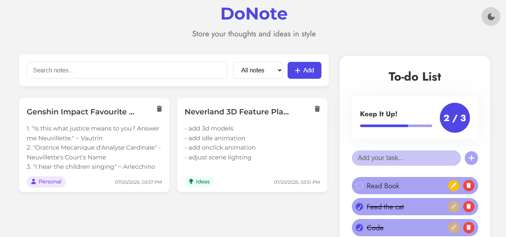
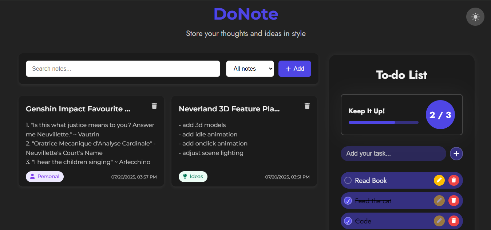

# DoNote
This is a web app madeto mimic a productivity app. It has the note-taking feature and the todo-list feature.

## Features
- dark/light mode

### Notes Section
- add note
- delete note
- search notes by name
- filter notes by tag

### Todo Section
- add task
- delete task
- edit task
- progress bar for completed tasks
- confetti animation on completing all tasks

## Learnings/Challenges
- deciding upon the overall UI theme (switched from glassmorphism to ultra minimalist dark to this)
- debugging JS
- learnt about localStorage in JS

## Credits
- made by: [unowen](https://github.com/pari55051)
- fonts: [Montserrat](https://fonts.google.com/specimen/Montserrat?icon.size=100&icon.color=%23e3e3e3), [Jost](https://fonts.google.com/specimen/Jost?icon.size=100&icon.color=%23e3e3e3&query=jost)
- icons: [font awesome](https://fontawesome.com/)
- assets: [undraw](https://undraw.co/)